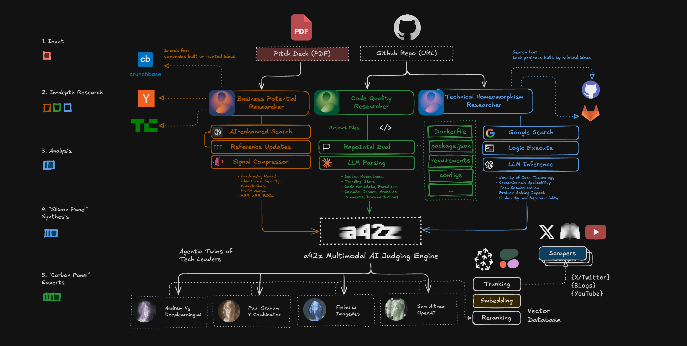

# 🏆 a42z Judge - The World's 1st Agentic Hackathon Judge

[](https://nextjs.org/)
[](https://www.typescriptlang.org/)

> **Building the Trust Layer for the AI Era - Capturing Real Signals Beyond the Hype**

a42z Judge is the world's first autonomous, insightful, and fair AI judging system for hackathons built by the team a42z. We're creating a comprehensive evaluation engine that combines multimodal AI analysis with expert knowledge to deliver transparent, explainable, and bias-reduced assessment results. We were honored to win 🏆 runner-up in the AI Agent Track (sponsored by [PPIO Cloud](https://ppio.com/)) at [AdventureX](https://adventure-x.org/en), China’s largest-ever hackathon, selected from over 8,000 applicants.

 *a42z Judge - Agentic System Architecture*

## 🌟 Vision

In the AI era, we need a new paradigm for evaluating innovation. Traditional hackathon judging relies heavily on subjective human judgment, leading to inconsistencies and missed opportunities. a42z Judge addresses this by creating a sophisticated AI-powered evaluation system that:

- **Cross-references** project materials (code, demo decks, PRDs) against open-source repositories and past winning cases
- **Leverages** quality signals like GitHub stars, activity metrics, and code quality indicators
- **Emulates** the judgment of tech industry leaders through AI twins
- **Delivers** structured, multi-dimensional assessments that go beyond simple scoring

## 🏗️ Architecture

### Core Components

#### 1. **Multimodal AI Judging Engine**
- **Input Processing**: Handles PDF pitch decks and GitHub repository URLs
- **Cross-Reference Analysis**: Compares against open-source projects and historical data
- **Quality Signal Extraction**: Analyzes GitHub metrics, code quality, and community engagement
- **Real-time Processing**: Streams analysis results through webhooks

#### 2. **Specialized AI Researchers**

**Business Potential Researcher**
- Sources: Crunchbase, TechCrunch, Y Combinator
- Metrics: Fundraising rounds, market share, MRR/ARR, ROI
- Analysis: Idea space capacity, profit margins, market trends

**Code Quality Researcher**
- Sources: GitHub API, RepoIntel, SonarQube
- Metrics: System robustness, trending/stars, commits/issues
- Analysis: Code metadata, paradigms, documentation quality

**Technical Homeomorphism Researcher**
- Sources: Dockerfiles, package.json, requirements, configs
- Metrics: Novelty of core technology, cross-domain applicability
- Analysis: Tech sophistication, problem-solving impact, scalability

#### 3. **Carbon Panel Experts**
AI twins of tech industry leaders providing structured evaluations:

- **Andrew Ng** (Deeplearning.ai) - AI/ML expertise
- **Paul Graham** (Y Combinator) - Startup evaluation
- **Feifei Li** (ImageNet) - Computer vision and research
- **Sam Altman** (OpenAI) - AI innovation and scaling

#### 4. **External Data Pipeline**
- **Scrapers**: X/Twitter, Blogs, YouTube
- **Processing**: Trunking, Embedding, Reranking
- **Storage**: Vector Database for semantic search

## 🚀 Features

### Real-time Analysis
- **Live API Calls**: Simulated external service integrations
- **Progress Tracking**: Real-time workflow step updates
- **Webhook Integration**: Dify API for advanced AI analysis
- **Database Storage**: Supabase for persistent results

### Interactive UI
- **Magic UI Components**: Animated cards, buttons, and effects
- **Terminal Animations**: Realistic API call simulations
- **Responsive Design**: Works across all devices
- **Dark Theme**: Modern, professional interface

### Expert Evaluation
- **Multi-dimensional Scoring**: Technical, business, innovation metrics
- **Structured Comments**: Bilingual (Chinese/English) expert feedback
- **Debate Simulation**: AI twins discuss and reach consensus
- **Transparent Process**: Full visibility into evaluation criteria

## 🛠️ Technology Stack

### Frontend
- **Next.js 15.2.4** - React framework with App Router
- **TypeScript 5.0** - Type-safe development
- **Tailwind CSS 4** - Utility-first styling
- **Framer Motion** - Smooth animations and transitions

### Backend & APIs
- **Dify API** - AI workflow orchestration
- **Supabase** - Database and authentication
- **GitHub API** - Repository analysis
- **Webhooks** - Real-time data flow

### UI Components
- **Magic UI** - Custom animated components
- **Radix UI** - Accessible component primitives
- **Lucide Icons** - Beautiful iconography
- **Shiki** - Syntax highlighting

### External Integrations
- **Crunchbase API** - Business intelligence
- **TechCrunch API** - News and trends
- **RepoIntel API** - Repository intelligence
- **SonarQube API** - Code quality analysis

 *a42z Judge - Video Demo*

## 📦 Installation

### Prerequisites
- Node.js 18+ 
- npm, yarn, or pnpm
- Supabase account
- Dify API access

### Quick Start

1. **Clone the repository**
```bash
git clone https://github.com/your-org/a42z-judge.git
cd a42z-judge
```

2. **Install dependencies**
```bash
npm install
# or
yarn install
# or
pnpm install
```

3. **Configure environment variables**
```bash
cp .env.example .env.local
```

Edit `.env.local` with your credentials:
```env
# Supabase Configuration
NEXT_PUBLIC_SUPABASE_URL=your_supabase_project_url
NEXT_PUBLIC_SUPABASE_ANON_KEY=your_supabase_anon_key
SUPABASE_SERVICE_ROLE_KEY=your_supabase_service_role_key

# Dify Configuration
NEXT_PUBLIC_DIFY_API_URL=https://api.dify.ai/v1
NEXT_PUBLIC_DIFY_API_KEY=your_dify_api_key
NEXT_PUBLIC_WEBHOOK_URL=https://your-domain.com/api/webhook/dify
```

4. **Set up the database**
```sql
-- Run the SQL from SUPABASE_SETUP.md
-- This creates the judge_comments table and necessary indexes
```

5. **Start the development server**
```bash
npm run dev
# or
yarn dev
# or
pnpm dev
```

6. **Open your browser**
Navigate to [http://localhost:3000](http://localhost:3000)

## 🔧 Configuration

### Dify Workflow Setup
1. Access your Dify workflow at: `https://cloud.dify.ai/app/your-app-id/develop`
2. Configure HTTP Request tool with webhook URL: `https://your-domain.com/api/webhook/dify`
3. Set up the analysis workflow for GitHub repository evaluation

### Supabase Database
1. Create a new Supabase project
2. Run the SQL commands from `SUPABASE_SETUP.md`
3. Configure Row Level Security (RLS) policies
4. Set up API keys and CORS settings

### Production Deployment
1. Deploy to Vercel or your preferred platform
2. Configure environment variables
3. Set up custom domain (optional)
4. Enable webhook endpoints

## 📊 Usage

### For Hackathon Organizers
1. **Upload Project Materials**: Submit GitHub repositories and pitch decks
2. **Real-time Analysis**: Watch as AI researchers evaluate projects
3. **Expert Feedback**: Receive structured comments from AI twins
4. **Transparent Results**: View detailed scoring and reasoning

### For Participants
1. **Submit Projects**: Upload GitHub links and documentation
2. **Track Progress**: Monitor analysis in real-time
3. **Receive Feedback**: Get expert evaluation and suggestions
4. **Understand Scores**: See detailed breakdown of assessments

### API Integration
```typescript
// Example: Submit a GitHub repository for analysis
const response = await fetch('/api/analyze', {
  method: 'POST',
  headers: { 'Content-Type': 'application/json' },
  body: JSON.stringify({
    repo_url: 'https://github.com/user/project',
    user_email: 'user@example.com'
  })
});
```

## 🎯 Key Benefits

### For Organizers
- **Consistent Evaluation**: AI-powered analysis reduces human bias
- **Scalable Process**: Handle hundreds of projects efficiently
- **Transparent Results**: Clear reasoning for all scores
- **Quality Assurance**: Cross-reference against industry standards

### For Participants
- **Fair Assessment**: Objective evaluation criteria
- **Detailed Feedback**: Expert-level comments and suggestions
- **Learning Opportunity**: Understand what makes projects successful
- **Recognition**: Merit-based scoring and ranking

### For the Community
- **Innovation Tracking**: Identify emerging trends and technologies
- **Quality Standards**: Establish benchmarks for hackathon projects
- **Knowledge Sharing**: Learn from successful project patterns
- **Ecosystem Growth**: Foster better hackathon experiences

## 🔮 Roadmap

### Phase 1: Core Platform ✅
- [x] Basic AI judging engine
- [x] GitHub repository analysis
- [x] Expert AI twins
- [x] Real-time UI

### Phase 2: Advanced Features 🚧
- [ ] Multi-language support
- [ ] Advanced code analysis
- [ ] Video demo evaluation
- [ ] Team collaboration features

### Phase 3: Ecosystem Integration 📋
- [ ] Hackathon platform integrations
- [ ] API marketplace
- [ ] Custom evaluation models
- [ ] Enterprise features

### Phase 4: AI Evolution 🔬
- [ ] Self-improving algorithms
- [ ] Domain-specific models
- [ ] Predictive analytics
- [ ] Automated insights

## 🤝 Contributing

We welcome contributions from the community! Here's how you can help:

### Areas of Contribution
- **AI Models**: Improve evaluation algorithms
- **UI/UX**: Enhance user experience
- **API Integrations**: Add new data sources
- **Documentation**: Improve guides and examples
- **Testing**: Add tests and improve coverage

### Code Style
- Follow TypeScript best practices
- Use Prettier for code formatting
- Write meaningful commit messages
- Add tests for new features

## 🙏 Acknowledgments

- **Tech Leaders**: Inspired by the insights of Andrew Ng, Paul Graham, Feifei Li, and Sam Altman
- **Open Source Community**: Built on the shoulders of amazing open-source projects
- **Hackathon Community**: For feedback and inspiration
- **AI Research Community**: For advancing the state of AI evaluation

---

**Built with ❤️ for the hackathon community**

*Empowering innovation through intelligent evaluation*
