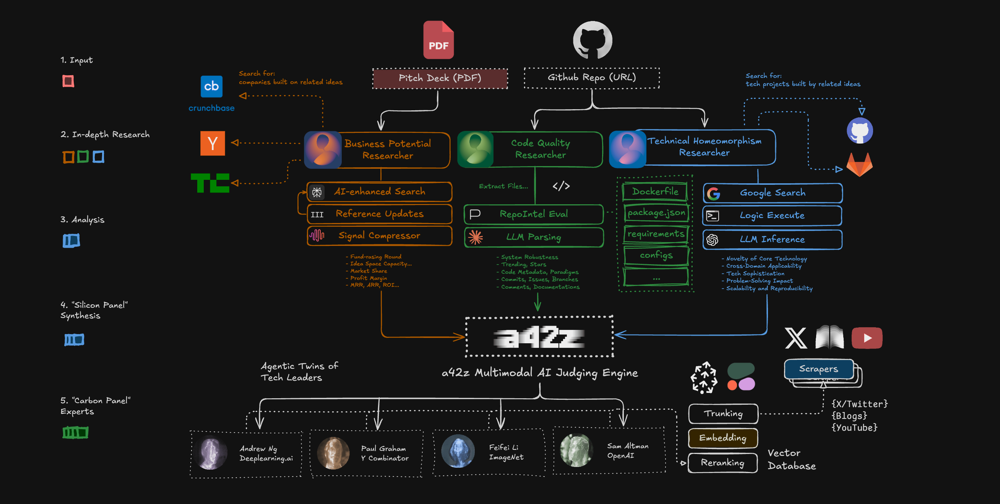

# a42z Judge

**48-hour hackathon build** — an agentic demo that scores hackathon projects from GitHub + pitch materials, with streamed “researcher” steps and stylized expert-style feedback.

Runner-up in the AI Agent Track (sponsor: [PPIO Cloud](https://ppio.com/)) at [AdventureX](https://adventure-x.org/en).

## Tech stack

- **App:** Next.js 15, TypeScript, Tailwind, Framer Motion, Radix / Magic UI-style components  
- **AI / data:** Dify workflows, Supabase, GitHub API + webhook flow, Pinecone  

## Demo

